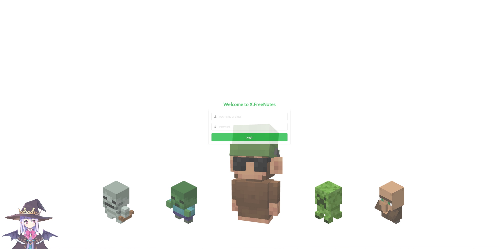
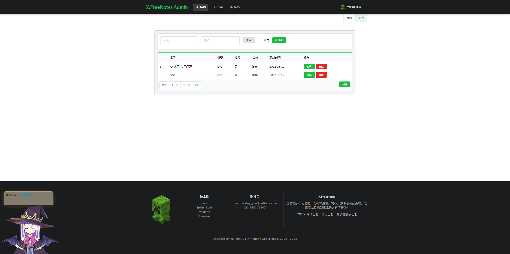
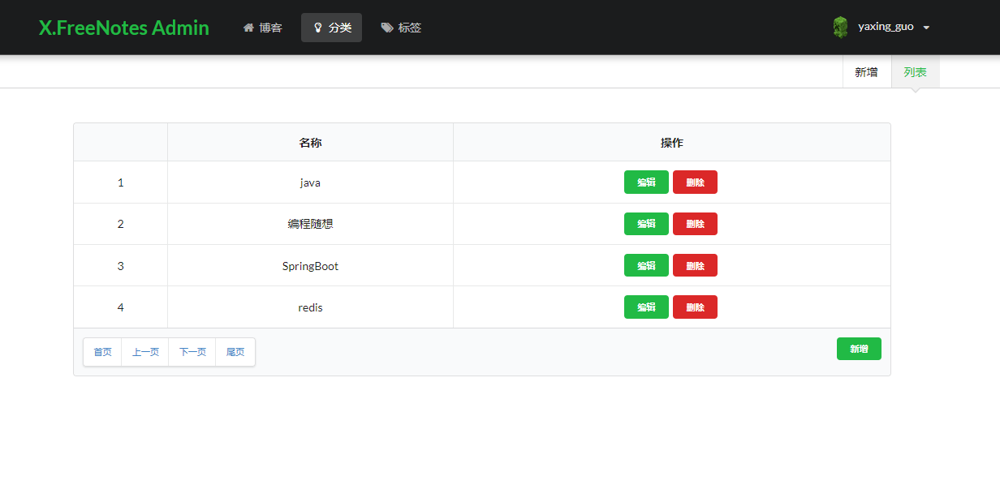
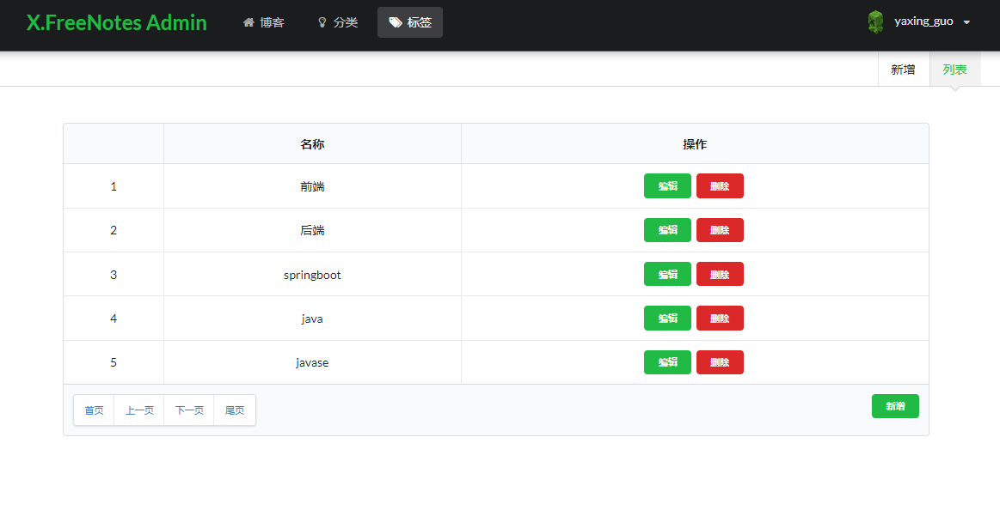
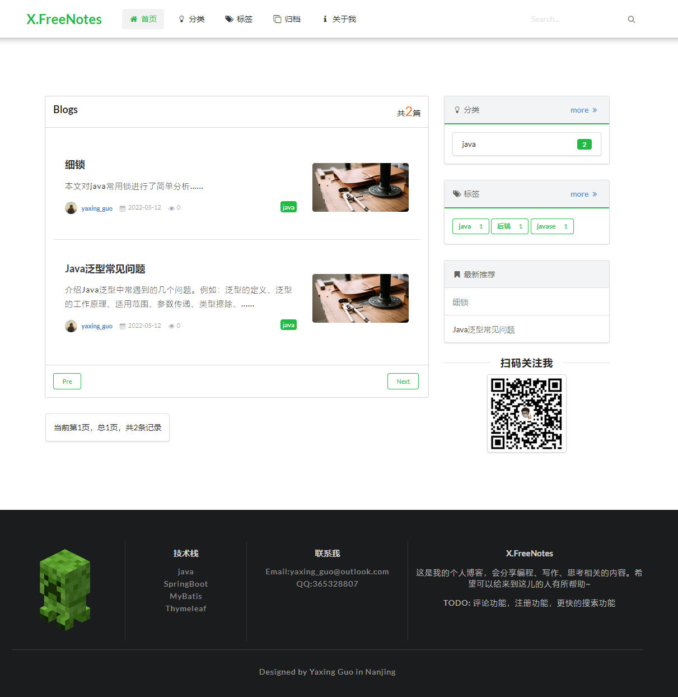
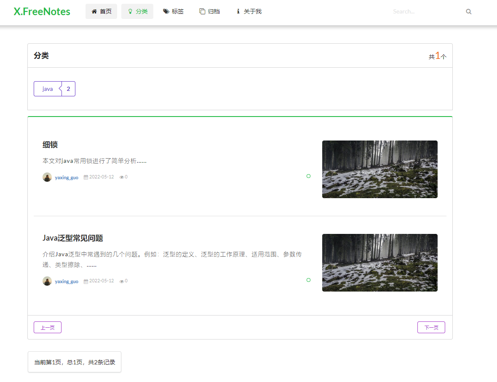
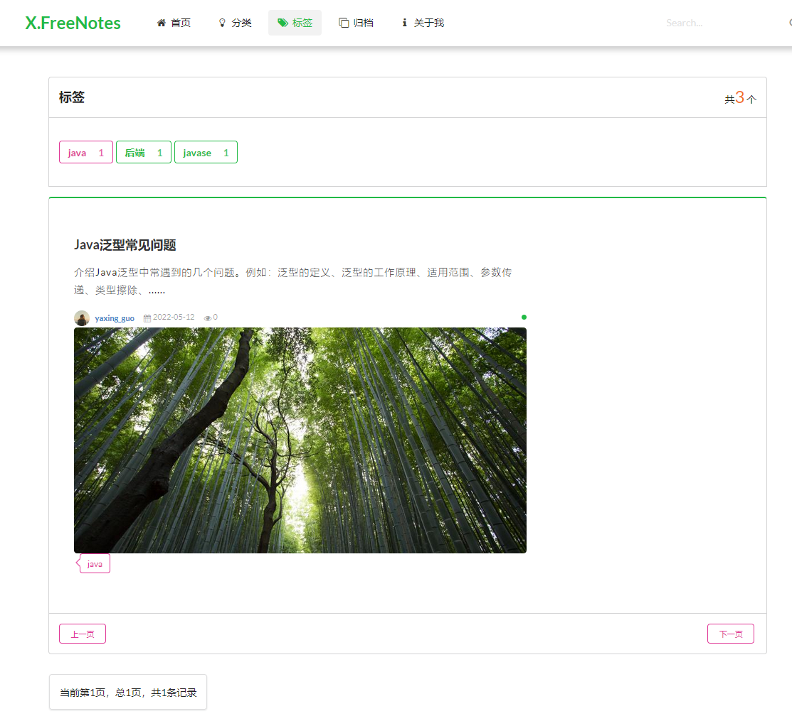
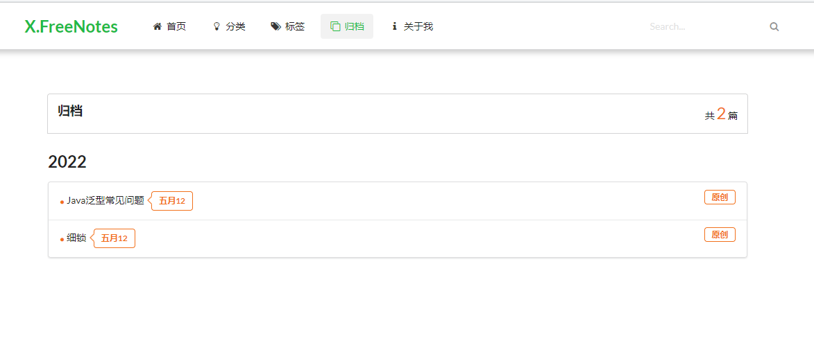
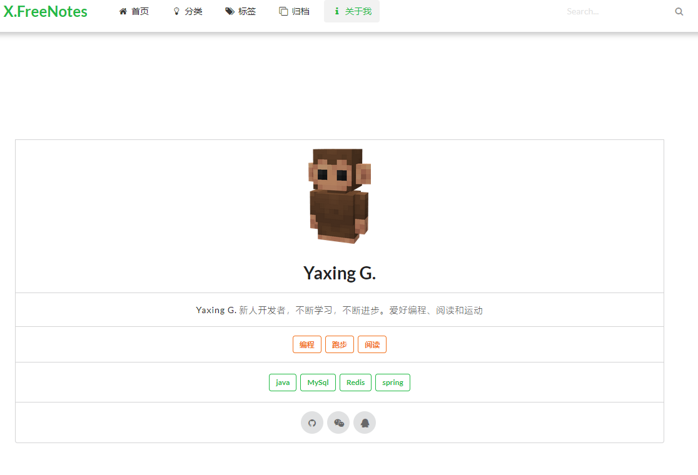

# X.FreeNotes
**个人博客项目，基于springBoot和myBatis实现**

访问地址：[博客首页](http://101.132.131.114:8080/)

项目文档：[博客搭建文档](http://101.132.131.114:8090/archives/yi-kuan-xiao-er-mei-de-ge-ren-bo-ke-xiang-mu)

**登录页面**

  

**博客管理页面**

  

**分类管理页面**

  

**标签管理页面**

  

**首页**

  

**分类前端页**

  

**标签前端页**

  

**归档页面**

  

**关于页面**

  

